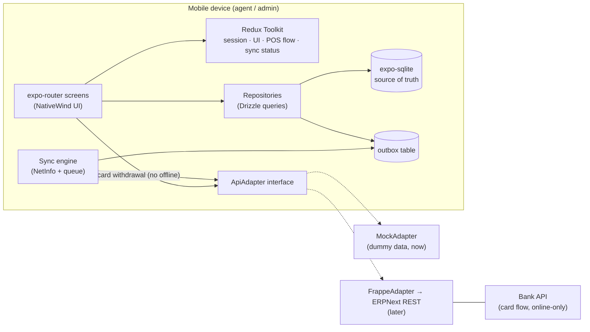
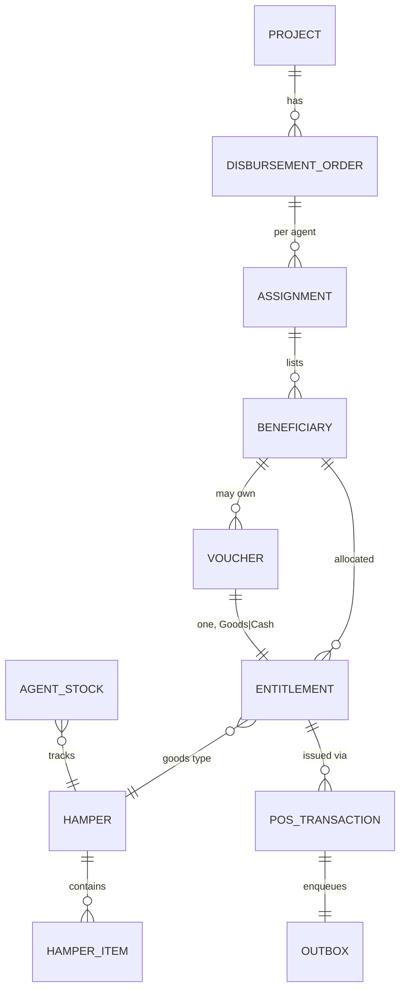
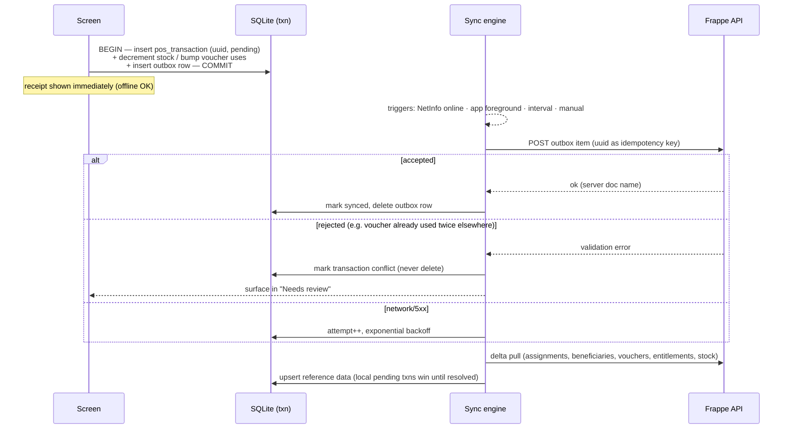

# NPPOS Architecture

Offline-first POS app for HDR goods & cash disbursement. Backend = Frappe/ERPNext (exists already, out of scope). This document is the blueprint; `AGENTS.md` holds the condensed rules.

## 1. System context



Principles:

1. **SQLite is the source of truth** for domain data. Screens read via Drizzle `useLiveQuery`; they never hold domain lists in Redux.
2. **Redux Toolkit** holds session/auth, the in-progress POS flow (selected beneficiary → entitlement → distribution type), UI state, and sync-engine status (pending count, last sync, errors). Persisted with redux-persist (auth + preferences only).
3. **Writes are transactional pairs**: domain row(s) + outbox row in one SQLite transaction. The UI is done at that point; sync happens in the background.
4. **The API is an interface.** `MockAdapter` seeds/serves dummy data now; `FrappeAdapter` implements the same interface against ERPNext later. Nothing above the adapter changes at swap time.

## 2. Why expo-sqlite + Drizzle (not WatermelonDB)

| Concern | expo-sqlite + Drizzle | WatermelonDB |
|---|---|---|
| Expo SDK 54 / New Arch | First-party, zero config | Works, but needs community config plugin + dev-client, known Podfile/simdjson friction |
| Sync with Frappe | You write pull/push — but you'd have to anyway (Frappe doesn't speak WatermelonDB's sync protocol) | Sync primitives exist but still require a custom backend adapter |
| Reactive UI | Drizzle `useLiveQuery` over change listeners | Excellent observables (its strong suit) |
| Redux coexistence | Clean split (domain in DB, app state in Redux) | Overlapping reactivity models |
| Typed schema/migrations | Drizzle schema in TS, drizzle-kit migrations | Schema + model classes, own migration system |
| Scale | Fine for an agent's slice (hundreds–low thousands of rows) | Wins at 10k+ rows / heavy observation |

**Decision: expo-sqlite + Drizzle.** The dataset per agent is small, the sync layer is custom either way, and first-party support removes a whole class of native-build risk. Revisit only if per-device data grows past tens of thousands of rows.

Note: SQLCipher encryption (`useSQLCipher`) doesn't work in Expo Go — adopting it means moving to a dev-client build (we'll need one eventually anyway for QR scanning/printing hardware).

## 3. Data model (local DB)

Reference data is pulled read-only; transactional tables are written locally and pushed.



| Table | Kind | Notes |
|---|---|---|
| `projects`, `disbursement_orders`, `assignments` | pulled | mandatory refs on every transaction |
| `beneficiaries` | pulled | only the agent's assigned slice; ben no, name, ID info, photo? |
| `vouchers` | pulled + counted locally | voucher no (unique = doc name on backend), **one entitlement per voucher** (`entitlement_type` cash \| hamper, mirrors Entitlement Voucher's Goods\|Cash), amount, validity from/to, status, `uses_count` (max 2, local-only rule), project/DO refs |
| `entitlements` | pulled | type: `hamper` \| `cash` \| `card`; qty/amount; status |
| `hampers`, `hamper_items` | pulled | BOM + components (item, unit, qty/household) |
| `agent_stock` | pulled + decremented locally | agent-warehouse levels per finished item |
| `pos_transactions` | local-first | uuid PK, type (`goods_issue` \| `cash_payment` \| `card_withdrawal` \| `stock_return`), refs (beneficiary/voucher, entitlement, project, DO), amount/qty, status: `pending` → `synced` \| `conflict`, created_at, synced_at |
| `outbox` | local | uuid, payload JSON, attempt count, next_retry_at, last_error |
| `sync_meta` | local | per-collection cursors/timestamps for delta pulls |

## 4. Sync engine (outbox pattern)



### ID strategy (local UUIDs vs Frappe naming series)

Frappe assigns document names (e.g. `ACC-PAY-2026-00001`) server-side at insert time, so offline-created rows can't know their server ID. Dual-ID rules:

- **Locally created rows** (`pos_transactions`): PK is the client UUID forever; nullable `server_name` column is filled from the sync response. Local FKs always point at the UUID — nothing is ever re-keyed.
- **The UUID is also the idempotency key**: a custom unique field (e.g. `custom_client_ref`) on Payment Entry / Stock Entry in Frappe. On push, the server returns the existing doc if the ref already exists instead of creating a duplicate — retries after mid-sync drops are safe, and it's the UUID → naming-series mapping.
- **Pulled-only rows** (beneficiaries, vouchers, entitlements, projects, DOs, hampers): use the Frappe `name` directly as the local PK — they're born on the server.
- UI never shows a server name until status is `synced`; receipts reference the UUID (or a short derivative), with the ERPNext doc name shown alongside after sync.

### Dependent records & outbox granularity

Local UUIDs are never sent as Frappe Link values — Frappe validates links against real doc names. Translation rules:

- **Outbox granularity = one row per business transaction.** If one POS action produces multiple mutually-referencing docs (payment + stock movement + voucher bump), they go in **one** composite outbox payload, not separate rows. Internal refs stay as UUIDs.
- **Composite payloads are submitted to a custom whitelisted Frappe method** (e.g. `nppos.api.submit_pos_transaction`) that creates all docs in one server-side DB transaction, resolves internal links itself (by `custom_client_ref`), and returns all resulting names. This gives atomicity — sequential REST calls can't (A lands, network dies, B never arrives).
- **Refs to previously synced records** are rewritten by the FrappeAdapter at push time: UUID → `server_name` lookup. FIFO flush guard: if a referenced UUID has no `server_name` yet, requeue. If the referenced item is in `conflict`, mark the dependent one `blocked` (never endless-retry); resolving the parent unblocks it.

**Backend team dependencies** (small, standard Frappe customizations — request together): `custom_client_ref` unique field on Payment Entry / Stock Entry, and the `submit_pos_transaction` whitelisted method.

Rules:

- **Idempotency**: the client UUID travels with every push; the backend must treat re-sends as no-ops. Retries are therefore always safe.
- **Ordering**: flush outbox FIFO per beneficiary/voucher so dependent entries arrive in order.
- **Conflicts**: server rejections (double-spent voucher, revoked entitlement) flag the local transaction `conflict` for supervised resolution — nothing is silently discarded.
- **Card flow is excluded**: card validate/balance/withdraw calls the bank API in real time and is disabled offline.
- **Pull strategy**: delta by `modified_since` cursor per collection (`sync_meta`); full re-pull as recovery escape hatch.

## 5. Screens & navigation (from POS diagram + spec)

```
Login
└── POS Dashboard (role-aware)
    ├── Cash Withdrawal Vouchers
    │   ├── Search (voucher no = exact match · ben no = list active vouchers)
    │   ├── Voucher detail — entitlements, uses left, validity
    │   └── Issue entitlement → cash: Payment Entry · hamper: Material Issue
    ├── Goods / Hampers
    │   ├── Beneficiary picker (assigned list) or voucher entry
    │   ├── Entitlement view (hamper contents, qty)
    │   └── Confirm issue → goods-issued entry (syncs to Stock Entry)
    ├── ATM / Bank Card  (online only)
    │   ├── Validate card → fetch balances
    │   └── Initiate withdrawal (beneficiary → agent account transfer)
    ├── Beneficiaries (assigned list, search, detail + history)
    ├── Transactions (history · pending sync · conflicts/"needs review")
    ├── Stock (agent warehouse levels · returns · damaged/expired)
    ├── Reconciliation (end-of-day summary, bulk cash reconciliation)
    ├── Profile / Settings (sync status, manual sync, logout)
    └── Admin (role-gated)
        ├── Agents overview (progress per agent)
        ├── Disbursement orders (summaries)
        └── Reports
```

### Navigation model

- `(app)/_layout.tsx` is a **Stack**; `(tabs)` is one screen of it (header hidden). Flow routes (`vouchers/`, `goods/`, `card/`, `reconciliation`, `admin/`) are sibling stack screens that **push full-screen over the tab bar** — deliberate: an agent mid-transaction can't accidentally switch tabs. Back/finish returns to the tab they left.
- **No drawer.** The Dashboard tab is a hub (big action tiles for Vouchers / Goods / Card / Reconciliation — mirrors `pos_design.jpeg`), so everything is ≤2 taps from launch. A drawer would duplicate the hub behind a hamburger.
- **Second entry path**: Beneficiary detail → entitlement → "Issue" deep-links into the flow with the beneficiary pre-selected ("person-first" vs "flow-first").
- **Card tile** is disabled + greyed when offline (online-only flow). Dashboard header shows a sync pill (online state + pending outbox count) and a "needs review" banner when conflicts exist.
- **Admin** = dashboard tile → pushed `admin/` stack, role-guarded in `admin/_layout.tsx` (not a 6th tab, not a drawer) — agents and admins share an identical baseline UI.
- Flow confirmation/success screens use `presentation: 'modal'` (no back-swipe into re-submission; dismiss returns to dashboard).

Route tree (expo-router):

```
src/app/
├── _layout.tsx                 # providers: SQLite, Redux store, portal, theme
├── login.tsx
├── +not-found.tsx
└── (app)/                      # auth guard (redirect to /login)
    ├── _layout.tsx
    ├── (tabs)/
    │   ├── _layout.tsx         # Dashboard · Beneficiaries · Transactions · Stock · Profile
    │   ├── index.tsx           # POS Dashboard
    │   ├── beneficiaries.tsx
    │   ├── transactions.tsx
    │   ├── stock.tsx
    │   └── profile.tsx
    ├── vouchers/
    │   ├── index.tsx           # search
    │   └── [voucherNo].tsx     # detail + issue entitlement
    ├── goods/
    │   ├── index.tsx           # beneficiary/voucher picker
    │   └── issue/[entitlementId].tsx
    ├── card/
    │   ├── index.tsx           # validate card (online gate)
    │   └── withdraw.tsx
    ├── beneficiaries/[id].tsx  # detail + history
    ├── reconciliation.tsx
    └── admin/                  # role guard in admin/_layout.tsx
        ├── _layout.tsx
        ├── index.tsx
        ├── agents.tsx
        └── orders.tsx
```

## 6. Source layout

```
src/
├── app/                    # routes only — thin, compose features
├── components/
│   ├── ui/                 # primitives (button, text, input, card, badge…)
│   └── domain/             # BeneficiaryCard, VoucherStatusBadge, EntitlementList,
│                           # SyncStatusPill, HamperContents, AmountKeypad…
├── db/
│   ├── schema.ts           # Drizzle schema (all tables above)
│   ├── client.ts           # openDatabaseSync + drizzle init (enableChangeListener)
│   ├── migrations/         # drizzle-kit output
│   └── seed.ts             # dummy-data seeding (dev only)
├── features/               # Redux slices + feature logic
│   ├── auth/               # slice, offline PIN re-auth
│   ├── pos/                # active flow slice (selection → confirm)
│   └── sync/               # slice (status) + engine (queue runner, triggers)
├── repositories/           # all Drizzle reads/writes; the ONLY module touching db/
│   ├── beneficiaries.ts · vouchers.ts · entitlements.ts
│   ├── stock.ts · transactions.ts · outbox.ts
├── services/
│   ├── api/
│   │   ├── types.ts        # ApiAdapter interface + DTOs
│   │   ├── mock/           # MockAdapter (dummy data, default now)
│   │   └── frappe/         # FrappeAdapter (later)
│   └── bank/               # card flow client (stub now)
├── hooks/                  # useIsOnline, useSyncStatus, useAssignedBeneficiaries…
├── lib/                    # utils, theme, constants, uuid
├── store/                  # RTK store, persist config, typed hooks
└── types/                  # shared domain types
```

Dependency direction: `app → features/components/hooks → repositories → db`, `sync engine → repositories + services/api`. Screens never import Drizzle or an adapter directly.

## 7. Decisions & things to settle before/while building

**Decided**
- expo-sqlite + Drizzle; Redux Toolkit for app state; outbox sync; adapter-interface API with dummy data first.

**Settle early**
1. **Offline login** — first login must be online (fetch token + assignments); afterwards re-auth with a locally stored PIN (hash in expo-secure-store). Define token refresh/expiry behavior when offline for days.
2. **Dev client vs Expo Go** — Expo Go is fine until we need SQLCipher, camera/QR voucher scanning, or receipt printers; plan the EAS dev-client switch as its own step.
3. **Voucher capture UX** — manual entry now; QR/barcode scan (expo-camera) later. Voucher numbers should be checksummed to catch typos.
4. **Conflict resolution UX** — who clears a `conflict` transaction (agent vs admin) and what the audit trail looks like.
5. **Multi-device / reassignment** — same agent on two devices, or beneficiary reassigned mid-day: server-side revalidation is the backstop; decide how aggressively to re-pull.
6. **Clock integrity** — offline timestamps come from the device; record both device time and sync time, never trust device time for validity-window enforcement alone.
7. **Receipts** — on-screen confirmation now; thermal-printer support later (drives dev-client decision).
8. **Security** — tokens in expo-secure-store; consider SQLCipher for beneficiary PII; blur/lock app in background switcher.
9. **i18n** — likely needed (field agents); wire up early (e.g. i18next) — retrofitting is painful.
10. **Merchant mode** — spec says merchants also distribute via POS profiles; same app with a `merchant` role flag rather than a separate app.

## 8. Backend mapping (for the later FrappeAdapter)

| App action | ERPNext document |
|---|---|
| Goods/hamper issue | Stock Entry (type **Issue**), agent-warehouse source, beneficiary/voucher inventory dimension |
| Cash via voucher | Payment Entry (type **Pay**), voucher no recorded instead of beneficiary |
| Card withdrawal | Real-time bank API; account deduction agent/beneficiary |
| Stock return | Stock Entry (type Issue) with client + project refs |
| End-of-day cash | Collection Reconciliation (bulk grouping) |
| Assignments in | Agent Disbursement Assignments from Disbursement Orders |
