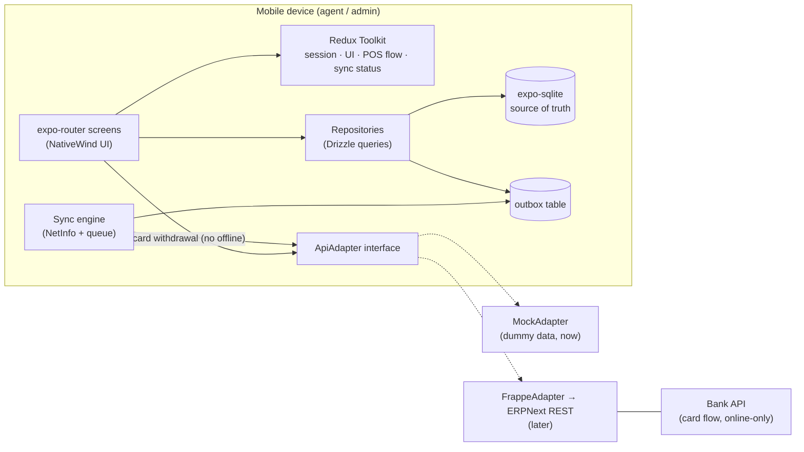
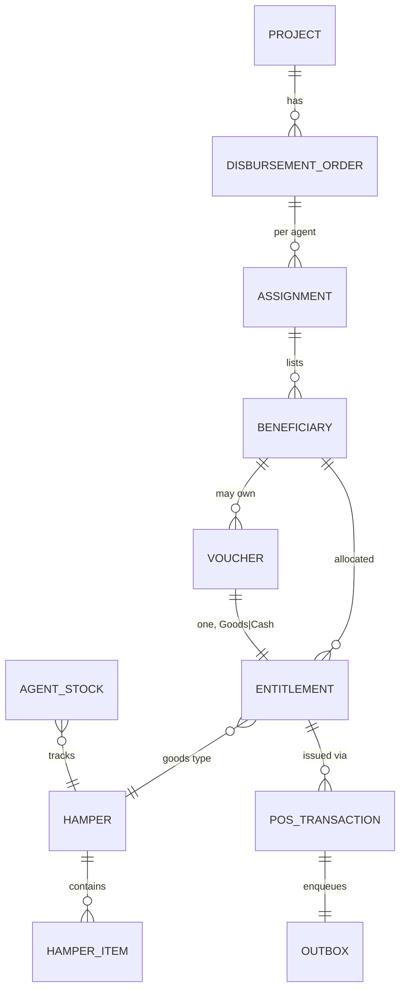
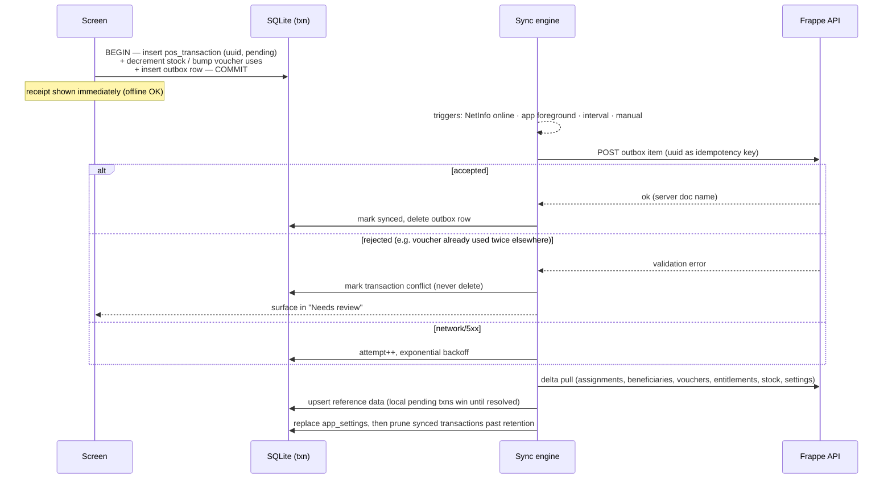

# NPPOS Architecture

Offline-first POS app for HDR goods & cash disbursement. Backend = Frappe/ERPNext (exists already, out of scope). This document is the blueprint; `AGENTS.md` holds the condensed rules.

> **Model note (voucher-centric).** The app mirrors the **nppos web POS**: the
> only domain objects an agent touches are **Entitlement Vouchers** and
> **Entitlement Redemptions**. A voucher carries its entitlement **inline**
> (Goods *or* Cash — no separate entitlements table). The agent never browses
> beneficiaries or projects/DOs; the agent-scoped **ADA (`assignments`)** is the
> only grouping that reaches the device, and `project` rides on the voucher as a
> plain name string. The later `FrappeAdapter` targets the **nppos** Frappe app's
> whitelisted methods (`nppos.sync_api.*`), *not* aigt_hdr. Some sections below
> still describe the earlier broader model (beneficiary lists, per-beneficiary
> entitlements, card flow) — treat those as historical.

## 1. System context



Principles:

1. **SQLite is the source of truth** for domain data. Screens read via Drizzle `useLiveQuery`; they never hold domain lists in Redux.
2. **Redux Toolkit** holds session/auth, the in-progress POS flow (selected beneficiary → entitlement → distribution type), UI state, and sync-engine status (pending count, last sync, errors). Persisted with redux-persist (auth + preferences only).
3. **Writes are transactional pairs**: domain row(s) + outbox row in one SQLite transaction. The UI is done at that point; sync happens in the background.
4. **The API is an interface.** `MockAdapter` seeds/serves dummy data now; `FrappeAdapter` implements the same interface against ERPNext later. Nothing above the adapter changes at swap time.

## 2. Why expo-sqlite + Drizzle (not WatermelonDB)

| Concern | expo-sqlite + Drizzle | WatermelonDB |
|---|---|---|
| Expo SDK 54 / New Arch | First-party, zero config | Works, but needs community config plugin + dev-client, known Podfile/simdjson friction |
| Sync with Frappe | You write pull/push — but you'd have to anyway (Frappe doesn't speak WatermelonDB's sync protocol) | Sync primitives exist but still require a custom backend adapter |
| Reactive UI | Drizzle `useLiveQuery` over change listeners | Excellent observables (its strong suit) |
| Redux coexistence | Clean split (domain in DB, app state in Redux) | Overlapping reactivity models |
| Typed schema/migrations | Drizzle schema in TS, drizzle-kit migrations | Schema + model classes, own migration system |
| Scale | Fine for an agent's slice (hundreds–low thousands of rows) | Wins at 10k+ rows / heavy observation |

**Decision: expo-sqlite + Drizzle.** The dataset per agent is small, the sync layer is custom either way, and first-party support removes a whole class of native-build risk. Revisit only if per-device data grows past tens of thousands of rows.

Note: SQLCipher encryption (`useSQLCipher`) doesn't work in Expo Go — adopting it means moving to a dev-client build (we'll need one eventually anyway for QR scanning/printing hardware).

## 3. Data model (local DB)

Reference data is pulled read-only; transactional tables are written locally and pushed.



**Current (voucher-centric) tables:**

| Table | Kind | Notes |
|---|---|---|
| `assignments` (ADA) | pulled | agent's own slice; `project`/`disbursement_order` are plain name strings, `amount_to_disburse`. The only grouping that reaches the device |
| `vouchers` | pulled + counted locally | voucher no (unique = doc name on backend). **Entitlement folded inline**: `entitlement_type` cash\|hamper, `amount` (cash) or `hamper_id`/`qty`/`uom`/`rate` (goods), plus `redeemed_amount`/`redeemed_qty` running totals for partial redemption. validity from/to, status, `uses_count`, `max_uses` (server-stamped from the POS App setting; every check goes through `maxUsesFor`), `project` string, `assignment_id`, and `warehouse` — the profile scope (see §7) |
| `hampers`, `hamper_items` | pulled | the finished item + its default-BOM expansion (item, unit, qty/household). Fallback contents for vouchers with no `bom_id` |
| `boms`, `bom_items` | pulled | ERPNext BOM + BOM Item — the authoritative hamper contents. A goods voucher names its own BOM (`vouchers.bom_id`), which is not always the item's default; `agent_stock.bom_id` is the default one, i.e. what a unit in the warehouse holds. Both feed the contents popup (`HamperContentsDialog`) |
| `beneficiaries` | pulled | the parties behind the agent's vouchers — name, ID number, status, household size. Identity confirmation at issue time only, never the case file. Walk-in vouchers have no row |
| `agent_stock` | pulled + decremented locally | agent-warehouse levels per finished item. `on_hand` comes from the server's Bin as a **full snapshot every pull** (stock changes never touch a voucher, so a delta-derived list would never carry them), reduced by whatever is still queued in the outbox to leave that warehouse. `issued_today` is a device-side day tally the backend has no notion of — set on insert, never overwritten by a pull |
| `voucher_redemptions` | local-first | one row per voucher use → backend Entitlement Redemption; links straight to the voucher, carries type/amount/qty |
| `pos_transactions` | local-first | uuid PK, type (`goods_issue` \| `cash_payment` \| `stock_return`), refs (voucher no, `project` string, `assignment_id`), `warehouse` (working context at record time — scopes the activity list), amount/qty, status: `pending` → `synced` \| `conflict`, created_at, synced_at. Synced rows beyond the retention setting are pruned after each sync (`pruneSyncedTransactions`); pending, needs-review and open-shift rows never are |
| `pos_profiles`, `pos_sessions` | pulled / local | POS Profile + shift (Opening/Closing Entry). A session row only survives if its POS Opening Entry reached the server — `openPosSession` pushes immediately and `discardUnsyncedPosSession` rolls it back otherwise, so `opening_server_name` is set for every open shift. `closing_photo_uri` keeps the local copy of the optional close-out photo attached to the closing entry |
| `outbox` | local | uuid, payload JSON, attempt count, next_retry_at, last_error |
| `sync_meta` | local | per-collection cursors/timestamps for delta pulls. The newest `last_pulled_at` is also "when this device last synced", which the offline-limit rule measures against |
| `app_settings` | pulled | server-driven app configuration (AIGT HDR Settings › POS App) as key/JSON-value rows, **replaced wholesale on every pull** — no cursor, no local edits. Typed via `src/lib/pos-settings.ts`, read through `useSettings()`/`getSettings()` |

Dropped in the voucher-centric refactor: `projects`, `disbursement_orders`,
`entitlements` (the erDiagram above is historical). `beneficiaries` came back in
a much smaller form — identity fields for the vouchers on the device, nothing
more.

## 4. Sync engine (outbox pattern)



**Backoff paces the background, never the agent.** A failed push gets an
exponential `next_retry_at` (5s · 2^attempt, capped at 10 min) so the automatic
triggers stop hammering a server that just refused them. Every *user-initiated*
sync passes `{ force: true }` to `syncNow` and takes the whole queue regardless
of that timer: the "Sync now" button, the profile picker's "Try again", the
dashboard's "Sync required" banner, and — most importantly — `flushNow`, which
every shift boundary runs through. Without this an agent whose last push failed
could not close their shift for up to ten minutes, with nothing on screen
explaining the wait, because the preflight refuses while the outbox is
non-empty. When a forced flush still leaves work queued, the refusal now quotes
the outbox's `last_error` instead of only counting rows.

### ID strategy (local UUIDs vs Frappe naming series)

Frappe assigns document names (e.g. `ACC-PAY-2026-00001`) server-side at insert time, so offline-created rows can't know their server ID. Dual-ID rules:

- **Locally created rows** (`pos_transactions`): PK is the client UUID forever; nullable `server_name` column is filled from the sync response. Local FKs always point at the UUID — nothing is ever re-keyed.
- **The UUID is also the idempotency key**: a custom unique field (e.g. `custom_client_ref`) on Payment Entry / Stock Entry in Frappe. On push, the server returns the existing doc if the ref already exists instead of creating a duplicate — retries after mid-sync drops are safe, and it's the UUID → naming-series mapping.
- **Pulled-only rows** (beneficiaries, vouchers, entitlements, projects, DOs, hampers): use the Frappe `name` directly as the local PK — they're born on the server.
- UI never shows a server name until status is `synced`; receipts reference the UUID (or a short derivative), with the ERPNext doc name shown alongside after sync.

### Dependent records & outbox granularity

Local UUIDs are never sent as Frappe Link values — Frappe validates links against real doc names. Translation rules:

- **Outbox granularity = one row per business transaction.** If one POS action produces multiple mutually-referencing docs (payment + stock movement + voucher bump), they go in **one** composite outbox payload, not separate rows. Internal refs stay as UUIDs.
- **Composite payloads are submitted to a custom whitelisted Frappe method** (e.g. `nppos.api.submit_pos_transaction`) that creates all docs in one server-side DB transaction, resolves internal links itself (by `custom_client_ref`), and returns all resulting names. This gives atomicity — sequential REST calls can't (A lands, network dies, B never arrives).
- **Refs to previously synced records** are rewritten by the FrappeAdapter at push time: UUID → `server_name` lookup. FIFO flush guard: if a referenced UUID has no `server_name` yet, requeue. If the referenced item is in `conflict`, mark the dependent one `blocked` (never endless-retry); resolving the parent unblocks it.

**Backend team dependencies** (small, standard Frappe customizations — request together): `custom_client_ref` unique field on Payment Entry / Stock Entry, and the `submit_pos_transaction` whitelisted method.

Rules:

- **Idempotency**: the client UUID travels with every push; the backend must treat re-sends as no-ops. Retries are therefore always safe.
- **Ordering**: flush outbox FIFO per beneficiary/voucher so dependent entries arrive in order.
- **Conflicts**: server rejections (double-spent voucher, revoked entitlement) flag the local transaction `conflict` for supervised resolution — nothing is silently discarded. **Resolution is an admin action and happens online** (decided): agents only see the "needs review" state; an admin resolves the conflict against live backend data (from the admin section or the backend UI), and the resolution syncs back on the next pull.
- **Card flow is excluded**: card validate/balance/withdraw calls the bank API in real time and is disabled offline.
- **Pull strategy**: delta by `modified_since` cursor per collection (`sync_meta`); full re-pull as recovery escape hatch.

## 5. Screens & navigation (from POS diagram + spec)

```
Login (email + password)
└── Select POS profile (working context: warehouse · currency; also reachable
    from Profile → "Switch POS profile" when no session is open)
    └── POS Dashboard (role-aware)
    ├── Cash Withdrawal Vouchers
    │   ├── Search (voucher no = exact match · ben no = list active vouchers ·
    │   │            QR scan → voucher no → opens the voucher directly)
    │   ├── Voucher detail — entitlements, uses left, validity
    │   └── Issue entitlement → cash: Payment Entry · hamper: Material Issue
    ├── Goods / Hampers
    │   ├── Beneficiary picker (assigned list) or voucher entry
    │   ├── Entitlement view (hamper contents, qty)
    │   └── Confirm issue → goods-issued entry (syncs to Stock Entry)
    ├── ATM / Bank Card  (online only)
    │   ├── Validate card → fetch balances
    │   └── Initiate withdrawal (beneficiary → agent account transfer)
    ├── Beneficiaries (assigned list, search, detail + history)
    ├── Transactions (history · pending sync · conflicts/"needs review")
    ├── Stock (agent warehouse levels · returns to central warehouse)
    ├── Reconciliation (end-of-day distribution summary + shift close)
    ├── Profile / Settings (sync status, manual sync, logout)
    └── Admin (role-gated)
        ├── Agents overview (progress per agent)
        ├── Disbursement orders (summaries)
        └── Reports
```

### Navigation model

- `(app)/_layout.tsx` is a **Stack**; `(tabs)` is one screen of it (header hidden). Flow routes (`vouchers/`, `goods/`, `card/`, `reconciliation`, `admin/`) are sibling stack screens that **push full-screen over the tab bar** — deliberate: an agent mid-transaction can't accidentally switch tabs. Back/finish returns to the tab they left.
- **No drawer.** The Dashboard tab is a hub (big action tiles for Vouchers / Goods / Card / Reconciliation — mirrors `pos_design.jpeg`), so everything is ≤2 taps from launch. A drawer would duplicate the hub behind a hamburger.
- **Second entry path**: Beneficiary detail → entitlement → "Issue" deep-links into the flow with the beneficiary pre-selected ("person-first" vs "flow-first").
- **Card tile** is disabled + greyed when offline (online-only flow). Dashboard header shows a sync pill (online state + pending outbox count) and a "needs review" banner when conflicts exist.
- **Connectivity is real + simulatable**: NetInfo drives `deviceOnline` in the sync slice; a "Simulate offline" switch (Profile) forces the effective state offline for testing. Everything gates on the effective `isOnline` (device online AND not simulating) — card flow, sync triggers, and login (an online-only action) all refuse when it's false.
- **Admin** = dashboard tile → pushed `admin/` stack, role-guarded in `admin/_layout.tsx` (not a 6th tab, not a drawer) — agents and admins share an identical baseline UI.
- Flow confirmation/success screens use `presentation: 'modal'` (no back-swipe into re-submission; dismiss returns to dashboard).

Route tree (expo-router) — **current** (voucher-centric):

```
src/app/
├── _layout.tsx                 # providers: SQLite, Redux store, portal, theme
├── login.tsx                   # step 1: email + password (ApiAdapter.login)
├── select-profile.tsx          # step 2: pick the POS profile to work under
├── +not-found.tsx
└── (app)/                      # auth guard (redirect to /login)
    ├── _layout.tsx
    ├── (tabs)/
    │   ├── _layout.tsx         # Dashboard · Search · Transactions · Stock · Profile
    │   ├── index.tsx           # POS Dashboard (session + search focus)
    │   ├── search.tsx          # voucher search (voucher no · beneficiary no)
    │   ├── transactions.tsx    # redemption/transaction history
    │   ├── stock.tsx
    │   └── profile.tsx         # session · sync · needs-review · settings · logout
    ├── vouchers/[voucherNo].tsx # voucher detail + redeem (cash/goods, partial)
    ├── card/index.tsx          # "Coming soon" placeholder (future bank flow)
    ├── transactions/[id].tsx   # transaction detail
    ├── reconciliation.tsx      # end-of-day session close
    └── admin/                  # role guard in admin/_layout.tsx
        ├── _layout.tsx
        ├── index.tsx
        ├── agents.tsx
        └── orders.tsx          # ADA (assignments) list
```

## 6. Source layout

```
src/
├── app/                    # routes only — thin, compose features
├── components/
│   ├── ui/                 # primitives (button, text, input, card, badge…)
│   └── domain/             # VoucherStatusBadge, PosSessionCard, SyncStatusPill,
│                           # TransactionRow, Screen, widgets, badges…
├── db/
│   ├── schema.ts           # Drizzle schema (all tables above)
│   ├── client.ts           # openDatabaseSync + drizzle init (enableChangeListener)
│   ├── migrations/         # drizzle-kit output
│   └── seed.ts             # dummy-data seeding (dev only)
├── features/               # Redux slices + feature logic
│   ├── auth/               # slice, offline PIN re-auth
│   ├── pos/                # active flow slice (selection → confirm)
│   └── sync/               # slice (status) + engine (queue runner, triggers)
├── repositories/           # all Drizzle reads/writes; the ONLY module touching db/
│   ├── queries.ts (reactive reads) · mutations.ts (redeem/session/stock writes)
│   ├── mappers.ts (row→domain) · sync.ts (pull upserts + push marking)
├── services/
│   ├── api/
│   │   ├── types.ts        # ApiAdapter interface + DTOs
│   │   ├── mock/           # MockAdapter (dummy data, default now)
│   │   └── frappe/         # FrappeAdapter (later)
│   └── bank/               # card flow client (stub now)
├── hooks/                  # useIsOnline, useSyncStatus, useAssignedBeneficiaries…
├── lib/                    # utils, theme, constants, uuid
├── store/                  # RTK store, persist config, typed hooks
└── types/                  # shared domain types
```

Dependency direction: `app → features/components/hooks → repositories → db`, `sync engine → repositories + services/api`. Screens never import Drizzle or an adapter directly.

## 7. Decisions & things to settle before/while building

**Decided**
- expo-sqlite + Drizzle; Redux Toolkit for app state; outbox sync; adapter-interface API with dummy data first.
- Conflict resolution (§7.4 below): **admin-only, online-only** — agents never clear a `conflict` themselves; the admin resolves it against live backend data.
- **Login is two-step**: system sign-in with **email + password** (backend: Frappe user), then a **POS profile picker** — the chosen profile is the session's working context (its warehouse scopes the stock view). Stored as `activePosProfileId` in the auth slice; the `(app)` guard redirects to `/select-profile` until one is chosen. **Login returns the user's POS profiles** (upserted into SQLite immediately) so the picker works on a fresh install before the first pull.
- **Token storage**: the auth token lives in **expo-secure-store** (OS keystore), held in memory by the ApiAdapter, restored on relaunch by `AuthBootstrap`. It is **never** in redux-persist/AsyncStorage (plaintext), and the **password is never stored**. Redux persists only `isAuthenticated`, `agent`, `role`, `activePosProfileId`. Offline PIN re-auth (§7.1) remains a separate future flow.
- **The active profile's warehouse is THE working context.** The pull covers the union of every warehouse the agent has a profile for, so the device holds more than the profile in use can act on — the warehouse is what narrows it back down. `agent_stock` is keyed `(warehouse, hamper)`; `vouchers.warehouse` scopes voucher lists and gates redemption (issuing a voucher from another warehouse against this shift would post the redemption to the wrong warehouse, so `loadVoucherForRedeem` refuses it and the voucher screen disables the action); `pos_transactions.warehouse` scopes the activity list. Goods issues and stock adjustments always act on the active profile's warehouse. **Exception:** an exact voucher-number lookup (typed or scanned) is deliberately *unscoped* — the agent is holding that specific voucher and deserves "belongs to WH-X", not "no match". Beneficiaries stay agent-scoped (they follow the person via the ADA).
- **The dashboard banner reads the active profile**, not `agent.code`: the latter is fixed at login from one arbitrarily-chosen profile and would keep naming that one after every switch.
- **Switching POS profiles** (Profile screen) requires no open POS session — close it first; a shift belongs to exactly one profile, and its redemptions are attributed to that profile's POS Opening Entry. **Sign-out is a full-system logout**: it auto-closes any open session and clears the active profile, so the next login re-picks one.
- **Behaviour that varies by programme is configuration, not code.** The POS App tab of AIGT HDR Settings is pulled in full on every sync (`pos_settings` → the `app_settings` table) and covers: how long a device may stay offline before it stops recording work, how many transactions it keeps, whether a scan may open a fully redeemed voucher, the per-voucher use limits (cash and goods), whether hamper contents and beneficiary details are shown, and whether the close-out photo is mandatory. Defaults live in `src/lib/pos-settings.ts` and are what a device that has never pulled runs on, so the mock adapter and an older backend both still work. Anything that changes a ledger outcome — the use limits — is re-checked server-side at submit; the rest is device-side presentation and is not worth a round trip.
- **Shift boundaries are online-only** (`src/features/sync/preflight.ts`). Opening a session, closing one, and signing out each run a full flush + pull first and abort if anything is still queued afterwards: opening must start from current vouchers/stock with no stale push in flight, closing's expected-cash figure is only true once every transaction it counts has landed, and sign-out closes the shift so it inherits both. The opening is then pushed immediately, so its POS Opening Entry **server name** exists before anything references it — session refs (`pos_closing.session`, `posSession`) are rewritten from the local session id to that name on the way out of the outbox (`resolveSessionRefs` in `src/repositories/sync.ts`). The one exception is the sign-out on the profile picker, kept ungated as the only escape from a screen with no other exit.

**Settle early**
1. **Offline login** — first login must be online (fetch token + assignments); afterwards re-auth with a locally stored PIN (hash in expo-secure-store). Define token refresh/expiry behavior when offline for days.
2. **Dev client vs Expo Go** — Expo Go is fine until we need SQLCipher, camera/QR voucher scanning, or receipt printers; plan the EAS dev-client switch as its own step.
3. **Voucher capture UX** — ~~manual entry now; QR/barcode scan (expo-camera) later~~ **done: scan on the Search screen** (`src/components/domain/QrScanner.tsx`, expo-camera `CameraView`). The backend generates one QR per Entitlement Voucher encoding its voucher number and attaches it to the voucher's `image` field (`/files/<voucherNo>-qr.png`), which the device pulls and can render. Manual entry stays as the fallback. Still open: checksummed voucher numbers to catch typos on manual entry.
4. **Conflict resolution UX** — ~~who clears a `conflict` transaction (agent vs admin)~~ **decided: admin, online-only**. Still open: the exact audit trail (who resolved what, when, and how it's recorded backend-side).
5. **Multi-device / reassignment** — same agent on two devices, or beneficiary reassigned mid-day: server-side revalidation is the backstop; decide how aggressively to re-pull.
6. **Clock integrity** — offline timestamps come from the device; record both device time and sync time, never trust device time for validity-window enforcement alone. The max-hours-offline rule (`syncFreshness`) compares the device clock against the last pull stamp, so a device set back far enough reads as fresh — server-side revalidation stays the backstop.
7. **Receipts** — on-screen confirmation now; thermal-printer support later (drives dev-client decision).
8. **Security** — tokens in expo-secure-store; consider SQLCipher for beneficiary PII; blur/lock app in background switcher.
9. **i18n** — likely needed (field agents); wire up early (e.g. i18next) — retrofitting is painful.
10. **Merchant mode** — spec says merchants also distribute via POS profiles; same app with a `merchant` role flag rather than a separate app.

## 8. Backend mapping (for the later FrappeAdapter)

| App action | ERPNext document |
|---|---|
| Goods/hamper issue | Stock Entry (type **Issue**), agent-warehouse source, beneficiary/voucher inventory dimension |
| Cash via voucher | Payment Entry (type **Pay**), voucher no recorded instead of beneficiary |
| Card withdrawal | Real-time bank API; account deduction agent/beneficiary |
| Stock return | Stock Entry (type Issue) with client + project refs |
| End-of-day cash | Collection Reconciliation (bulk grouping) |
| Assignments in | Agent Disbursement Assignments from Disbursement Orders |
